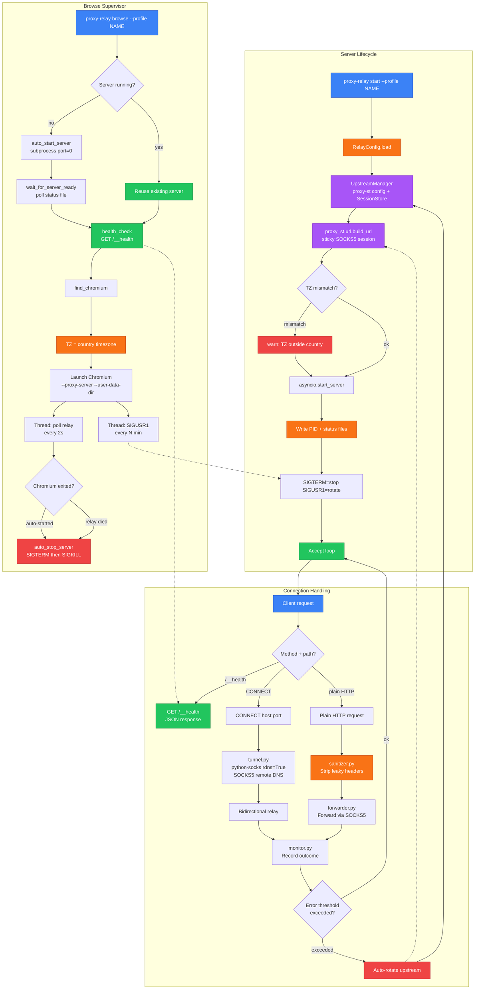

# Proxy-Relay Flow Diagram

proxy-relay is a local HTTP CONNECT proxy that forwards all traffic through an upstream SOCKS5 proxy managed by proxy-st. It provides three main flows: **Server Lifecycle** (start, accept, handle connections), **Connection Handling** (CONNECT tunnels, plain HTTP forwarding, health checks), and **Browse Supervision** (auto-start server, launch Chromium with proxy and timezone spoofing, auto-rotate upstream).

Key security properties:
- **DNS leak prevention**: All hostnames are resolved remotely via SOCKS5 (`rdns=True`, ATYP=0x03). Local DNS is never touched.
- **Header sanitization**: Privacy-leaking headers (`X-Forwarded-For`, `Via`, `Proxy-Authorization`, etc.) are stripped from forwarded HTTP requests.
- **Timezone spoofing**: The `TZ` environment variable is set on Chromium to match the proxy exit country, defeating JavaScript timezone fingerprinting.

